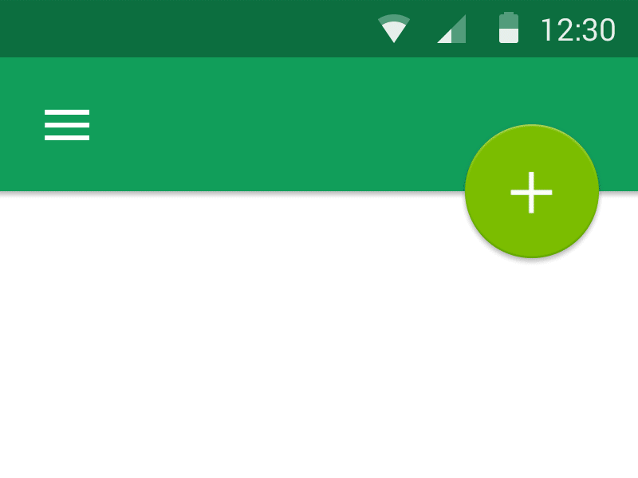
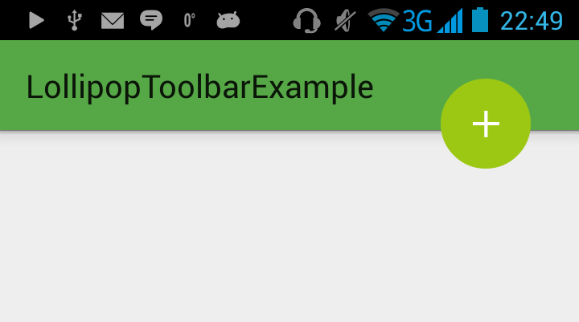

LollipopAnimation
=================
This is example project to show how we could make this kind of animation on Android L device. 

# Installation

Just open it in AndroidStudio !

GET DEMO ON GOOGLE PLAY!

https://play.google.com/store/apps/details?id=com.kulaga.lollipoptoolbarexample

### How to use it :

LpActionButton: 

  There are class called LpActionButton. It inflates view and binds it to our ActionBar (if we don't have one - then during view initialization will be thrown NoActionBarException)
  
    LpActionButton mLpActionButton = LpActionButton.createLpActionButton(this,R.layout.button_my_lp);
  
  where button_my_lp is layout of our view. 
  
  And we have nice and shiny button. Viola! 
  
  
  
  Then we need to set up listners for click events, listeners for animation events , add drawables for changed states, 
  and our button could possibly begin to work. 
  
 How it looks like on a REAL device!!

  

  I think it's pretty good, heh
  

